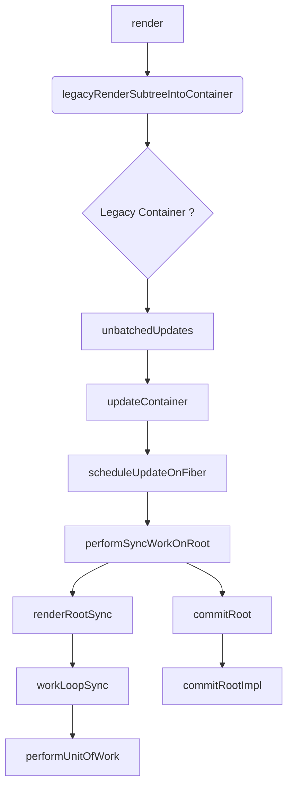

# React

The rendering flow:

```
(1) render -> legacyRenderSubtreeIntoContainer -> unbatchedUpdates -> updateContainer
(2) updateContainer -> scheduleUpdateOnFiber -> performSyncWorkOnRoot
(2.a) performSyncWorkOnRoot -> renderRootSync -> workLoopSync
(2.b) performSyncWorkOnRoot -> commitRoot -> commitRootImpl
```

* Render and Commit are done in different phases
* Render is where the differences are calculated
* Commit is where the DOM is updated / manipulated
* 
* 


##### `legacyRenderSubtreeIntoContainer`
Path: `react/packages/react-dom/src/client/ReactDOMRootFB.js`
Accepts: children: ReactNodeList,
Children is the JSON representation of DOM tree.
$$typeof$$: is there to avoid security issues. You have to add a symbol to avoid identical JSON representation into React world.
* legacy means non-concurrent rendering mode
* `$0.__reactRootContainer` object should be present globally under window object
* default is fiberRoot
* non default is `__reactRootContainer`
* Initial Mount should not be batched
* 
##### `unbatchedUpdates`
Accepts: fn
Accepts: a

* sets previous execution context
*  

##### `insertOrAppendPlacementNodeIntoContainer`

Path: `react/packages/react-reconciler/src/ReactFiberCommitHostEffects.js`


* `insertOrAppendPlacementNode`
* `commitPlacement`
* 

##### `updateContainer`
* requestUpdateLane
* lane is a number
* getContextForSubtree
* enqueueUpdate(current$1, update);
* current$1 is a Fiber Node
* scheduleUpdateOnFiber


#### ReactFiberLane - Lane
* SelectiveHydrationLane
* SyncLane
* HighestPriorityPendingLanes
* higherPriorityLane

* **UpdateLanes**
  * SyncLane
  * InputContinuousLane
  * DefaultLane
  * TransitionLanes

* **HydrationLanes**
  * SyncHydrationLane
  * InputContinuousHydrationLane
  * DefaultHydrationLane
  * TransitionHydrationLane
  * SelectiveHydrationLane
  * IdleHydrationLane

* performSyncWorkOnRoot
* performSyncWorkOn
* workLoopSync() -> A continuous do...while loop, 


#### getContextForSubtree


#### ForceUpdate


#### Work In Progree Root


#### createUpdate
createUpdate
const update = createUpdate(SyncLane);
const update = createUpdate(eventTime, lane);
* SyncLane
* 

