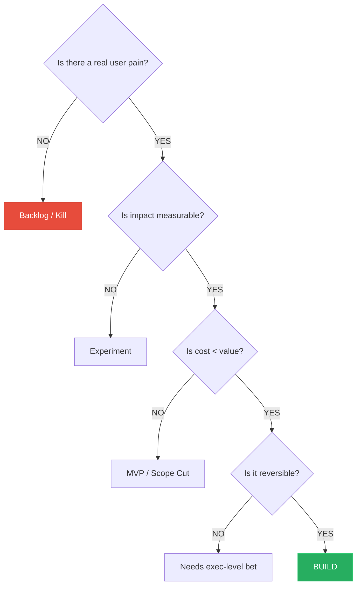

# Product Prioritization Decision Tree

```mermaid
flowchart TD
    Start{Is there a real user pain?}
    
    Start -- NO --> Kill[Backlog / Kill]
    Start -- YES --> Measurable{Is impact measurable?}
    
    Measurable -- NO --> Experiment[Experiment]
    Measurable -- YES --> Cost{Is cost < value?}
    
    Cost -- NO --> MVP[MVP / Scope Cut]
    Cost -- YES --> Reversible{Is it reversible?}
    
    Reversible -- NO --> Exec[Needs exec-level bet]
    Reversible -- YES --> Build[BUILD]

    %% Styling for clarity
    style Build fill:#27ae60,stroke:#2ecc71,color:#fff
    style Kill fill:#e74c3c,stroke:#c0392b,color:#fff
```
