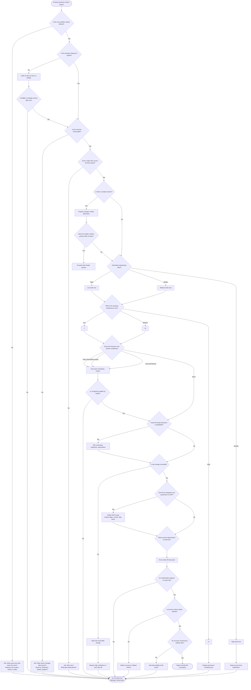

# Ultra Detailed

## Product Prioritization Decision Tree

```mermaid
flowchart TD
    A([Product proposes a fancy feature]) --> B{Is the user problem clearly defined?}

    B -- No --> B1[Ask: What exact user pain does this solve?<br/>Request user quotes, tickets, or data]
    B1 --> Z[Defer: Problem not validated]

    B -- Yes --> C{Is this problem frequent & painful?}

    C -- No --> C1[Label as Nice-to-have or Delight]
    C1 --> C2{Is delight a strategic priority right now?}

    C2 -- No --> Z
    C2 -- Yes --> D

    C -- Yes --> D{Is the outcome measurable?}

    D -- No --> D1[Ask: What metric changes after launch?<br/>Revenue, Retention, Speed, Support?]
    D1 --> Z

    D -- Yes --> E{Does it align with current business goals?}

    E -- No --> E1[Ask: Why now?<br/>What gets deprioritized?]
    E1 --> Z

    E -- Yes --> F{Is there a simpler solution?}

    F -- Yes --> F1[Propose cheaper / faster alternative]
    F1 --> F2{Does the simpler solution achieve 80% of value?}

    F2 -- Yes --> F3[Proceed with simpler solution]
    F2 -- No --> G

    F -- No --> G{Estimated engineering effort?}

    G -->|Days| H
    G -->|Weeks| I
    G -->|Months| J

    H[Low build cost] --> K
    I[Medium build cost] --> K
    J[High build cost] --> J1[Require exec-level justification]
    J1 --> Z

    K{What is the ongoing maintenance cost?}

    K -->|Low| L
    K -->|Medium| M
    K -->|High| N

    N --> N1[Explain permanent complexity tax]
    N1 --> Z

    L --> O
    M --> O

    O{Does this introduce new system complexity?}

    O -->|New schemas| P
    O -->|New states| P
    O -->|New permissions| P
    O -->|None| Q

    P[Document complexity impact] --> P1{Is complexity justified by impact?}

    P1 -- No --> Z
    P1 -- Yes --> Q

    Q{Does this break backward compatibility?}

    Q -- Yes --> Q1[Plan versioning, migrations, deprecation]
    Q1 --> R

    Q -- No --> R{Is the change reversible?}

    R -- No --> R1[High-risk irreversible change]
    R1 --> R2[Require high confidence or exec sign-off]
    R2 --> Z

    R -- Yes --> S{Can this be shipped as an experiment or MVP?}

    S -- Yes --> S1[Define MVP scope<br/>Feature flags, cohorts, fake doors]
    S1 --> T

    S -- No --> T{What must be deprioritized to build this?}

    T --> T1[Force trade-off discussion]
    T1 --> T2{Are stakeholders aligned on trade-offs?}

    T2 -- No --> Z
    T2 -- Yes --> U

    U{Is success criteria clearly defined?}

    U -- No --> U1[Define success & rollback metrics]
    U1 --> Z

    U -- Yes --> V{Do we have monitoring & rollback plan?}

    V -- No --> V1[Add observability & kill switch]
    V1 --> Z

    V -- Yes --> W([Approve build with constraints])

    Z([Do not build now<br/>Backlog / Revisit later])

```
